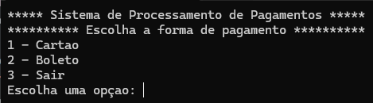
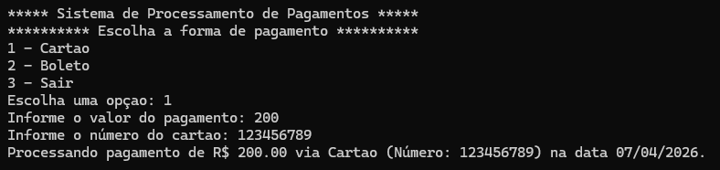
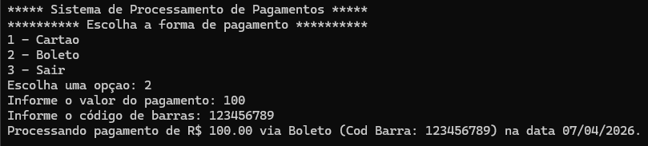

# Simulação - Sistema de Pagamento

Aplicação console desenvolvida em C# (.NET 8) que simula um sistema de processamento de pagamentos, permitindo pagamento via Cartão ou Boleto.

## Estrutura do Projeto

sistemaDePagamento/
├── Models/
│   ├── Pagamento.cs            # Classe base abstrata
│   ├── PagamentoCartao.cs      # Pagamento via cartão
│   └── PagamentoBoleto.cs      # Pagamento via boleto
├── Service/
│   └── Menu.cs                 # Classe estática do menu
├── Program.cs                  # Ponto de entrada da aplicação
└── sistemaDePagamento.csproj

## Integramtes 

- Beatriz Vieira de Novais | RM554746
- Guilherme Abe | RM554743
- Gustavo Ruiz Vieira Paulino | RM554779
- Mariana Neugebauer Dourado | RM550494
- Victor Pacifico Dias | RM558017

## Exemplos de Uso

### Menu

### Pagamento via Cartão

### Pagamento via Boleto 
